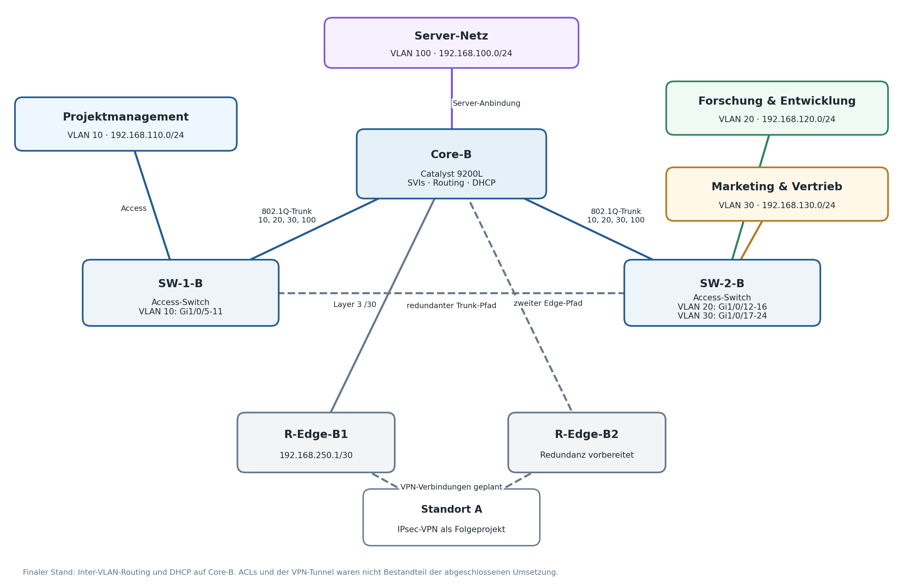

# VLAN-basierte Cisco-Netzwerkinfrastruktur

Dieses Repository dokumentiert ein schulisches Teamprojekt am BSZ Wiesau. Ziel war es, für einen simulierten Unternehmensstandort eine strukturierte und segmentierte Netzwerkinfrastruktur aufzubauen und zu konfigurieren.

## Netzwerkplan

Der Netzwerkplan zeigt den umgesetzten Stand der VLAN-Struktur. ACLs und die VPN-Anbindung waren als Erweiterung vorgesehen, aber nicht Teil der abgeschlossenen Umsetzung.

## Projektumfang

- Einrichtung separater VLANs für verschiedene Abteilungen
- Konfiguration von Access-Ports und 802.1Q-Trunks
- Einrichtung von SVIs und Inter-VLAN-Routing
- Konfiguration der DHCP-Adressvergabe
- Anbindung eines Edge Routers über ein Transitnetz
- Erarbeitung eines ACL-Konzepts zur Einschränkung des Netzwerkzugriffs
- Vorbereitung redundanter Netzwerkpfade
- Durchführung von Funktionstests und Fehleranalysen
- Dokumentation der Konfiguration und Testergebnisse

## Verwendete Technik

- Cisco Catalyst 9200L
- Cisco Catalyst 8200 Edge Router
- Cisco Access Switches
- VLAN und IEEE 802.1Q
- IPv4 und Subnetting
- DHCP
- Inter-VLAN-Routing
- ACL-Konzept
- Cisco IOS CLI

## Netzwerkaufteilung

| VLAN | Bereich |
|------|---------|
| VLAN 10 | Projektmanagement |
| VLAN 20 | Forschung und Entwicklung |
| VLAN 30 | Marketing und Vertrieb |
| VLAN 100 | Servernetz |

## Mein Beitrag

Das Projekt wurde im Team umgesetzt. Mein Schwerpunkt lag auf der Mitarbeit an der CLI-Konfiguration, dem Troubleshooting, den Funktionstests und der Dokumentation. Dabei habe ich Konfigurationen geprüft, Fehler eingegrenzt und die Ergebnisse der Tests dokumentiert.

## Herausforderungen

Während der Umsetzung mussten unter anderem eine nicht bekannte Gerätekonfiguration wiederhergestellt, Adresskonflikte untersucht und Abweichungen bei der Konfiguration der Trunk-Verbindungen behoben werden. Anschließend wurde die Funktion der VLANs, der DHCP-Adressvergabe und der Netzwerkverbindungen getestet.

## Erkenntnisse

Durch das Projekt konnte ich meine Kenntnisse in den Bereichen VLAN-Konfiguration, Routing, DHCP und systematischer Fehleranalyse vertiefen. Besonders wichtig waren eine einheitliche Konfiguration aller Netzwerkgeräte, nachvollziehbare Tests und eine saubere Dokumentation.

## Projektdokumentation

[Öffentliche Portfolio-Dokumentation als PDF ansehen](docs/VLAN-Netzwerkprojekt_Portfolio.pdf)

Die kompakte Fassung enthält die Netzwerkplanung, ausgewählte Konfigurationsbeispiele, die Fehleranalyse, Funktionstests und eine klare Abgrenzung meines persönlichen Beitrags.

> Hinweis: Das Projekt wurde in einer schulischen Laborumgebung durchgeführt. Verwendete Konfigurationen und IP-Adressen stellen keine produktive Unternehmensumgebung dar.
